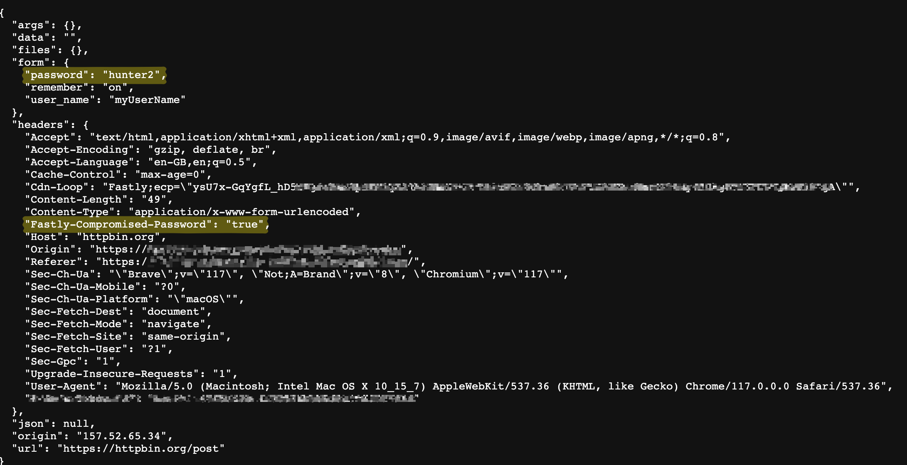

<h1 align="center">
  <br> Password Compromise Check using Compute@Edge
</h1>

<h4 align="center">Enrich requests containing a password with a header to indicate if the password is compromised.</h4>

---
This Compute@Edge service when setup in front of a backend, can inspect the passwords submitted either at login or signup, to verify if the password is compromised (leaked in previous known data breaches) using the [HaveIBeenPwned](https://haveibeenpwned.com/Passwords) passwords dataset. While this check can be done by using the HIBP [APIs](https://haveibeenpwned.com/API/v3#PwnedPasswords), this implementation uses pre-generated filters for the spilled password hashes, persisted on Fastly [KV Stores](https://docs.fastly.com/en/guides/working-with-kv-stores) for fast lookups. Once the password is verified to be compromised, the service adds a header to the request to indicate the same. The backend can then choose to reject the password (signup use-case), take user to a password reset page (login use-case), send a signal to a credential stuffing detector or take other actions.

We use [BinaryFuse8](https://pkg.go.dev/github.com/FastFilter/xorfilter@v0.1.4) filters with 9 bit fingerprints per entry. While filters are probablistic data structures, given the fingerprint size and load factors, we estimate a false positive rate of about 0.3%. The use of filters also compresses the dataset from about 38GB to 1GB. To further reduce resource consumption, we group the password hashes using a 3 character prefix, create a separate filter for each prefix and store them in a KV store. This allows us to only load the filters for the prefixes that are relevant to the password being checked. These prefix filters are typically about 250KB.

This implementation used [httpbin](https://httpbin.org/) as the backend, but you can use any backend of your choice while setting up the service on step 4.

## Prerequisites

You will need full access to a Fastly [account](https://www.fastly.com/signup/) with KV store enabled. The Fastly CLI and other dependencies listed below should be installed on your workstation. You will also need to setup a Fastly API token which will be used to upload the generated filters to the KV store.

## Dependencies

* [Go](https://go.dev/doc/install)
* [TinyGo](https://tinygo.org/getting-started/install/)
* [Fastly CLI](https://developer.fastly.com/learning/tools/cli)

## Setup

The setup process involves the following steps:

### 1. Create a KV Store
```sh
$ fastly kv-store create --name=hibp_filters

SUCCESS: Created KV Store 'hibp_filters' (<store_id_of_created_store>)
```
Take note of the store id of the created KV store, which will be used in subsequent steps.
### 2. Clone the repository and update configs
```sh
$ git clone https://github.com/fastly/compute-hibp-filter.git
```
Update the authors field in the `fastly.toml` and the `KV_STORE_NAME` in [config/consts.go](config/consts.go).

### 3. Generate and upload filters
```sh
$ go run cmd/upload/main.go -token <Fastly_API_token> 
```
This step pulls the hashes from HIBP API, creates the filters for a prefix (starting from 000 to FFF), and uploads the filters to the KV store. Allow up to a couple of hours for this step to complete.

An additional `-from` flag is available to restart the upload from a specific prefix. This is useful in case the upload is interrupted midway.
```sh
$ go run cmd/upload/main.go -token <Fastly_API_token> -from A0F
```

### 4. Deploy the Compute@Edge service
```sh
$ fastly compute publish

SUCCESS: Deployed package (service <service_id_for_service>, version 1)
```
This will take your through a new service setup and the defaults should be fine. Once the service is setup, you will be presented with the domain to access the service. You can use this domain to test the service at the end of the setup.

### 5. Link KV Store and activate the service
```sh
$ fastly resource-link create --resource-id=<store_id_of_created_store> --version=latest --autoclone
$ fastly service-version activate --version=latest
```

## Usage

Visit the service with your web browser using the domain provided in step 4. You will see a page with a form to submit a password. Enter a password and submit the form. The service will respond with a page that shows the password and a header `Fastly-Compromised-Password` indicating if the password is compromised. 

<div align="center">
  
</div>

## Trouble-shooting
Use the following command to tail the service logs. When the KV store is not linked to the service, the check is skipped and an error message is logged.
```sh
$ fastly log-tail
```
